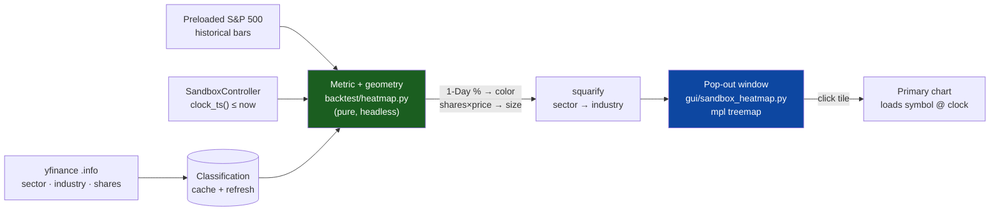

# Sandbox Heatmap

A **Finviz-style market heatmap for sandbox bar-replay**. It renders the
S&P 500 as a sector → industry treemap, sized by market cap and colored
by percent change — but every value is computed from **historical data
as of the current replay clock**, so as you step bars forward the map
reflects the market *at that historical moment*. Finviz is real-time;
this is the same glance-read experience rewound to any point in the
tape, for maximum fidelity to what you would have seen live.

> **Status: design spec — v1 not yet implemented.** This document and
> the two colocated specs
> ([`backtest/heatmap.spec.md`](../src/tradinglab/backtest/heatmap.spec.md),
> [`gui/sandbox_heatmap.spec.md`](../src/tradinglab/gui/sandbox_heatmap.spec.md))
> capture the finalized design ahead of code, per the repo's
> spec-driven convention. The eleven decisions below were settled with
> the owner in a design consultation.

---

## Why it exists

The owner trades Pete Stolcers' (OneOption) relative strength/weakness
method: **market → sector → RS/RW stock → confluence → timed entry**.
A heatmap accelerates the top of that funnel — "where is money
flowing right now?" — and, in the sandbox, lets the owner *practice*
that read against historical tape. Click any tile to pull the symbol
onto the primary chart and drill into the daily + intraday confluence.

---

## The eleven design decisions (v1)

| # | Decision | Choice |
|---|---|---|
| 1 | Universe | **S&P 500** map (Finviz default), preloaded for the replay window; **point-in-time membership** via the `Date added` filter (look-ahead removed) + coverage label |
| 2 | Data source | **yfinance** → sector / industry (`.info`) + **historical shares series** (`get_shares_full`); cached + refresh updater (no scraping) |
| 3 | Tile size | **Historically-scaled cap** = `shares(t) × price(t)`, split-consistent; `shares(t)` from `get_shares_full` snapped to clock; pre-series → carry back earliest-known (flagged approximate) |
| 4 | Color metric | **Raw 1-Day % change** (pure Finviz); RS / vs-SPY deferred, seam kept clean |
| 5 | Timeframe | **1-Day only** in v1; 1W / 1M / 3M / 6M / 1Y / YTD in v2 |
| 6 | Layout | Sector → industry **squarified treemap** (vendored ~40-line squarify, no new dependency) |
| 7 | Placement | **Dedicated non-modal pop-out window**, launched from the Sandbox menu |
| 8 | Live update | **Colors update every bar; sizes update per session/day** (stable within a session) |
| 9 | Blind mode | **Respected** — "Replay Bar N", no dates / absolute levels; keep tickers, sectors, % |
| 10 | Interactivity | **Click → load symbol on primary chart** + hover tooltip + highlight current ticker & open positions |
| 11 | Palette | **Finviz-exact red / green ±3% bucketed scale**; colorblind palette deferred to v2 |

---

## Architecture

Three modules, deliberately split so the math is testable without a
display:

1. **`backtest/heatmap.py`** — pure metric + geometry layer. No Tk, no
   matplotlib. Turns candles + classification + a clock timestamp into
   a laid-out, colored `HeatmapModel`. Fully headless-testable.
2. **`gui/sandbox_heatmap.py`** — the non-modal pop-out window.
   Embeds a matplotlib treemap (`Rectangle` patches on
   `FigureCanvasTkAgg`, the `gui/performance_view.py` pattern), wires
   hover / click, applies dark-mode theming, and refreshes on each
   replay tick.
3. **Classification + shares provider** *(build task, not one of the two
   core specs)* — a small yfinance-backed cache of `sector` / `industry`
   (`.info`) plus the **historical shares series** (`get_shares_full`)
   per symbol, persisted to disk and refreshed on a schedule. Injected
   into both layers so neither fetches inline.

---

## Metric definitions

- **Color — 1-Day % change (as of the replay clock):**
  `(price_at_or_before(clock) − prior_session_close) / prior_session_close`.
  `prior_session_close` is the close of the session before the current
  replay session; it requires prior-day data to be preloaded for every
  universe symbol.
- **Size — historically-scaled market cap:** `shares(t) × price(t)`,
  both on the **same split basis** (raw price × raw shares, so a split
  is a wash). `shares(t)` is the historical share count snapped to the
  current replay **session** (yfinance `get_shares_full`, ~11y deep,
  most-recent value ≤ the session date). **When price history is deeper
  than the shares series,** sizing before the series start **carries
  back the earliest known count** (nearest-in-time — never today's) and
  flags those tiles approximate + counts them in the coverage label; the
  session anchor price keeps sizes stable within a session and updates at
  each session roll (decision 8). This captures buybacks and dilution —
  the real economic share-count drift a static current-shares assumption
  would miss. **The split trap:** `get_shares_full` returns
  *raw, as-reported* shares, so e.g. AAPL's raw count reads +163% since
  2015 purely from the 2020 4:1 split, while split-adjusted it *shrank*
  ~34% via buybacks. Multiplying split-adjusted price × raw shares
  over-sizes by the split ratio — hence the raw × raw rule.
- **No future leakage (hard invariant):** every value derives only from
  candles at or before `SandboxController.clock_ts()`. The pure layer
  consumes caller-supplied prices; the window derives them exclusively
  from `visible_candles_by_symbol` (which is already clock-bounded).
  `clock_ts()` is **UTC epoch seconds** — normalize before comparing
  against millisecond candle timestamps.

---

## Layout, color, and interaction

- **Squarified treemap**, grouped sector → industry. A vendored ~40-line
  squarify keeps the aspect ratios readable without adding a
  dependency. Unknown classification (a symbol yfinance can't classify)
  falls into an **Unclassified** group rather than being dropped.
- **Finviz-exact color scale:** fixed diverging red ↔ neutral ↔ green,
  bucketed and clipped at **±3%**. Tile label color flips between
  near-white and near-black by tile luminance for legibility.
- **Recolor every bar, relayout per session** (decision 8): the window
  tracks `controller.current_session_date()`; geometry is rebuilt only
  when the session rolls, while facecolors update on every tick — cheap
  and non-disorienting.
- **Interactivity** (decision 10): click a tile → load that symbol on
  the primary sandbox chart at the current clock; hover → tooltip
  (ticker, sector / industry, %, price, and a position badge if held);
  the tile for the currently-charted ticker is outlined and open
  positions are badged.

---

## Blind mode

The sandbox blind / auto-cycle mode hides the calendar date to prevent
hindsight bias. The heatmap **respects it** (decision 9): the window
title reads "Replay Bar N", tooltips omit the date and any absolute
index level, and no timeframe label leaks the era. Tickers, sectors,
and relative % stay visible so the tool remains useful during blind
practice.

---

## Fidelity caveats (surfaced in-UI)

The map is honest about what it can and cannot reproduce; a footer
label states these:

- **Membership is point-in-time via the `Date added` filter.** The map
  shows only members whose `sp500.csv` `Date added` ≤ the replay clock,
  so look-ahead names (183 of today's 503 were added after 2015) are
  removed and the composition evolves as you replay across an add date.
  **Residual survivorship gap:** names that *left* the index before
  today are still absent (they aren't in `sp500.csv`) — a footer
  coverage label quantifies this (e.g. "468 members · 12 removed names
  unavailable"). Full point-in-time membership (a Wikipedia changes-log
  reconstruction) is v2; survivorship-free delisted price data needs a
  paid provider (later). Members resolve by **CIK / name, not bare
  ticker**, so a recycled ticker can't pull the wrong company.
- **Sector / industry classification is current.** GICS assignments can
  change; the map uses today's.
- **Share count is historical, not point-in-time-perfect.** Tile size
  uses yfinance `get_shares_full` snapped to the replay session, so
  buybacks / dilution *are* captured (and splits cancel via the raw ×
  raw rule). **The series is ~11y deep, but price history can be deeper**
  — before the series starts, sizing **carries back the earliest known
  count** (nearest-in-time, not today's) and those tiles are flagged
  approximate + counted in the coverage label. Depth upgrades: SEC EDGAR
  XBRL (~2009, CIK in `tools/sp500.csv`), then a paid provider (decades)
  — both shrink the carry-back gap but never fully close it (pre-2009
  XBRL doesn't exist). The map is pixel-faithful back to the shares-
  series start; deeper replays are clearly-marked approximate — a
  **fidelity horizon**, not a hard cutoff.

Color — the part that drives the read — is fully historical and
clock-bounded; membership is point-in-time (look-ahead removed, minus
the labeled survivorship residual) and share count is historical — only
**classification** (sector / industry) remains a current snapshot.

---

## Phasing

**v1 (this design):** S&P 500 · yfinance classification · historically-
scaled cap sizing · raw 1-Day % color · Finviz palette · squarified
sector → industry treemap · pop-out window · recolor-per-bar /
relayout-per-session · click-to-chart + focus / position highlight ·
point-in-time membership (Date-added filter) + coverage label ·
blind-mode compliant.

**v2+ (deferred, seams left in place):**

- RS / relative-to-SPY color mode, and the owner's pluggable custom-RS
  metric as a selectable color basis.
- Additional Finviz timeframes (1W / 1M / 3M / 6M / 1Y / YTD).
- Sector-strength aggregates (median constituent RS, % of constituents
  outperforming SPY) for a faster rotation read.
- Colorblind-friendly palette toggle.
- Industry-drill zoom with breadcrumb.
- Full US-market map.
- Full point-in-time membership via a vendored Wikipedia changes-log
  reconstruction (recovers removed names' membership; delisted price
  data still bounded by the provider). Survivorship-free membership +
  delisted bars via a paid source (Norgate / Sharadar / CRSP) is a
  later opt-in.
- Deeper historical shares via SEC EDGAR XBRL (~2009; the CIK is already
  in `tools/sp500.csv`), then a paid provider (decades), to shrink the
  pre-series carry-back gap.

---

## Testing plan

- **Pure layer** (`tests/unit/backtest/test_heatmap.py`): squarify
  invariants (rects tile the parent, no negative dims, deterministic),
  1-Day % math incl. epoch-seconds normalization, historically-scaled
  cap, sector → industry grouping, Unclassified fallback, ±3% color
  bucketing, missing-data → neutral.
- **Window** (`tests/unit/gui/test_sandbox_heatmap.py`): Agg-safe render
  of a synthetic small universe, hover hit-test maps a point to the
  expected tile, click loads the symbol, dark-mode facecolors applied,
  blind-mode title omits the date.
- **Smoke** (`tests/smoke`): a `check_g*_sandbox_heatmap` reachability
  check — enter sandbox, open the heatmap, advance a bar, assert the
  map refreshes and leaks no date under blind mode. (No `transient()`
  call, so no macOS skip per CLAUDE.md §7.1 is needed.)

---

## See also

- [`backtest/heatmap.spec.md`](../src/tradinglab/backtest/heatmap.spec.md) — pure metric + geometry layer.
- [`gui/sandbox_heatmap.spec.md`](../src/tradinglab/gui/sandbox_heatmap.spec.md) — pop-out window.
- [`backtest/replay.spec.md`](../src/tradinglab/backtest/replay.spec.md) — the `SandboxController` this reads from.
- [`UNIVERSES.md`](UNIVERSES.md) — the preload / basket system that feeds the S&P 500 universe.
