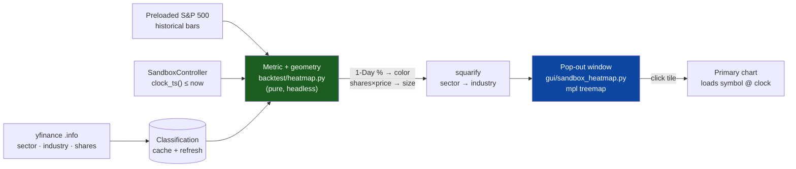

# Market Heatmap

A **Finviz-style market heatmap**, in two modes behind one window.

**Sandbox mode** (Sandbox → Market Heatmap…) renders the S&P 500 as a
sector → industry treemap, sized by the chosen basis and colored by
percent change — but every value is computed from **historical data as
of the current replay clock**, so as you step bars forward the map
reflects the market *at that historical moment*. Finviz is real-time;
this is the same glance-read experience rewound to any point in the
tape, for maximum fidelity to what you would have seen live.

**Live mode** (View → Live Market Heatmap) is the same window on the
current tape, with no sandbox session required.

> **Status: v1 implemented; live mode added.** This document and the
> colocated specs
> ([`backtest/heatmap.spec.md`](../src/tradinglab/backtest/heatmap.spec.md),
> [`gui/sandbox_heatmap.spec.md`](../src/tradinglab/gui/sandbox_heatmap.spec.md),
> [`gui/heatmap_context.spec.md`](../src/tradinglab/gui/heatmap_context.spec.md))
> capture the design, per the repo's spec-driven convention. The eleven
> decisions below were settled with the owner in a design consultation.

---

## Live mode

### Why it streams instead of polling

A heatmap is the wrong shape for REST. Refreshing 500 symbols
continuously would consume the request budget that on-demand chart loads
and background history depend on — and it would do so to rebuild a value
the quote wire already carries.

So live mode subscribes **once** to a quote feed and paints from a
coalescing snapshot. The universe is near-static day to day, which is
exactly the case a subscription is built for: subscribe at open, add or
drop the occasional name, never poll. API calls stay available for what
genuinely needs them — deep history, drill-downs, backfill.

The wider principle the app now follows: **streams for breadth, REST for
depth.** Wide + shallow + real-time (many symbols, last price) is a
stream's job; narrow + deep + historical (one symbol, thousands of bars)
is REST's.

### A quote feed also removes a whole class of bug

The sandbox path had to be hardened against reading a daily bar's
settled close into a mid-session clock (see *Fidelity caveats* below).
A quote feed cannot make that mistake: last price and the previous
session's official close arrive **in the same message**, so there is no
historical series to index into incorrectly. Cumulative day volume
likewise arrives consolidated, rather than being summed from whatever
bars a vendor happened to give us.

### Configuring it

| Setting | Meaning |
|---|---|
| `heatmap_quote_source` | Which quote feed to use (e.g. `schwab-quotes`), or `off`. Empty is treated as off. |
| `heatmap_stale_after_s` | Seconds since a symbol's last print before its tile is dimmed. Default 120. |

Schwab is currently the only real quote adapter, and it requires a
completed OAuth login (**Tools → Connect to Schwab…**). Without a
configured feed the live map still opens and reads from cached bars —
it simply says so in the footer rather than pretending to be live.

### Staleness is a correctness feature, not decoration

In replay, a symbol is either priced at the clock or it is grey. Live is
messier: symbols go stale **independently**, and at wildly different
rates. A thin name's last print can be forty minutes old while a
mega-cap updates every second.

Two tiles that render identically when one of them is half an hour old
is precisely how a trader acts on a price that no longer exists. So:

- a tile past `heatmap_stale_after_s` is **dimmed** (hatching already
  means "approximate size", and both facts have to be readable at once);
- hovering it reports **how old** the print is;
- the title states the market state — `OPEN`, `PRE-MARKET`,
  `AFTER HOURS`, `CLOSED` — so a closed-market map is never mistaken for
  a live one;
- a **dead feed** is reported separately in the footer. It freezes every
  symbol at once, and dimming 500 tiles individually would bury the one
  fact that matters.

The clock itself is never clamped: outside market hours the map reports
the true time and the true (stale) data, rather than back-dating itself
to the last close and hiding that nothing has moved.

---

## Why it exists

The owner trades Pete Stolcers' (OneOption) relative strength/weakness
method: **market → sector → RS/RW stock → confluence → timed entry**.
A heatmap accelerates the top of that funnel — "where is money
flowing right now?" — and, in the sandbox, lets the owner *practice*
that read against historical tape. Click any tile to pull the symbol
onto the primary chart and drill into the daily + intraday confluence.

---

## The eleven design decisions (v1)

| # | Decision | Choice |
|---|---|---|
| 1 | Universe | **S&P 500** map (Finviz default), preloaded for the replay window; **point-in-time membership** via the `Date added` filter (look-ahead removed) + coverage label; narrowed to the session's prepared universe when one is set |
| 2 | Data source | **The session's own source** — pinned at Sandbox Start (`sandbox_data_source`, default Auto) and read off `SandboxController.data_source`, so the map is priced from the same tape the replay runs on; sector / industry + historical shares series are cached (no scraping) |
| 3 | Tile size | **Selectable basis** (`heatmap_size_basis`): historically-scaled cap (default, split-consistent — the as-reported count is lifted onto the price series' basis via `split_factor_after`), **dollar volume** (needs no share count at all), or **equal weight**. Pre-series cap → carry back earliest-known (flagged approximate) |
| 4 | Color metric | **Raw 1-Day % change** (pure Finviz); RS / vs-SPY deferred, seam kept clean |
| 5 | Timeframe | **1-Day only** in v1; 1W / 1M / 3M / 6M / 1Y / YTD in v2 |
| 6 | Layout | Sector → industry **squarified treemap** (vendored ~40-line squarify, no new dependency) |
| 7 | Placement | **Dedicated non-modal pop-out window**, launched from the Sandbox menu |
| 8 | Live update | **Colors update every bar; sizes update per session/day** (stable within a session) |
| 9 | Blind mode | **Respected** — "Replay Bar N", no dates / absolute levels; keep tickers, sectors, % |
| 10 | Interactivity | **Click → load symbol on primary chart** + hover tooltip + highlight current ticker & open positions |
| 11 | Palette | **Finviz-exact red / green ±3% bucketed scale**; colorblind palette deferred to v2 |

---

## Architecture

```mermaid
flowchart LR
    Y["yfinance .info<br/>sector · industry · shares"] --> C[("Classification<br/>cache + refresh")]
    P["Preloaded S&P 500<br/>historical bars"] --> M
    K["SandboxController<br/>clock_ts() ≤ now"] --> M["Metric + geometry<br/>backtest/heatmap.py<br/>(pure, headless)"]
    C --> M
    M -->|"1-Day % → color<br/>shares×price → size"| S["squarify<br/>sector → industry"]
    S --> W["Pop-out window<br/>gui/sandbox_heatmap.py<br/>mpl treemap"]
    W -->|"click tile"| CH["Primary chart<br/>loads symbol @ clock"]
    style M fill:#1b5e20,color:#fff
    style W fill:#0d47a1,color:#fff
```

Three modules, deliberately split so the math is testable without a
display:

1. **`backtest/heatmap.py`** — pure metric + geometry layer. No Tk, no
   matplotlib. Turns candles + classification + a clock timestamp into
   a laid-out, colored `HeatmapModel`. Fully headless-testable.
2. **`gui/sandbox_heatmap.py`** — the non-modal pop-out window.
   Embeds a matplotlib treemap (`Rectangle` patches on
   `FigureCanvasTkAgg`, the `gui/performance_view.py` pattern), wires
   hover / click, applies dark-mode theming, and refreshes on each
   replay tick.
3. **Classification + shares provider** *(build task, not one of the two
   core specs)* — a small yfinance-backed cache of `sector` / `industry`
   (`.info`) plus the **historical shares series** (SEC EDGAR XBRL)
   per symbol, persisted to disk and refreshed on a schedule. Injected
   into both layers so neither fetches inline.

---

## Metric definitions

- **Color — 1-Day % change (as of the replay clock):**
  `(intraday_price_at(clock) − prior_session_close) / prior_session_close`.
  The two legs deliberately use **different** clock rules:
  - the **price** leg is the close of the last *intraday* bar at or
    before the clock, within the clock's own session. Intraday bars are
    point-in-time, so a bar at/before the clock is information the
    trader genuinely had.
  - the **base** leg is the close of the last **completed** daily
    session (`completed_session_closes`, strictly-before rule — the same
    one `SandboxController.daily_visible_for` uses for the daily chart).

  **Why the split matters (this was a real bug):** a daily bar is
  timestamped at its *open* but carries the session's *settled close*.
  A single "last bar whose timestamp ≤ clock" lookup therefore admits
  the in-progress day's daily bar and returns the finished day's price
  from the opening print onward — the map showed the answer for the
  whole replay, and since both legs were then constant it never changed
  intraday either. Daily bars must never go through the at-or-before
  rule.

  When a symbol has no intraday coverage for the session, the map falls
  back to the last **two completed** daily sessions (still leak-free,
  just a session stale) and says so in the footer + tooltip.
- **Size — historically-scaled market cap:** `shares(t) × price(t)`,
  both on the **same split basis**. `shares(t)` is the historical share
  count snapped to the current replay **session** (yfinance
  SEC EDGAR XBRL, ~2009+, most-recent value already *filed* at the session date).
  **When price history is deeper than the shares series,** sizing before
  the series start **carries back the earliest known count**
  (nearest-in-time — never today's) and flags those tiles approximate +
  counts them in the coverage label; the session anchor price keeps
  sizes stable within a session and updates at each session roll
  (decision 8). This captures buybacks and dilution — the real economic
  share-count drift a static current-shares assumption would miss.

  **The split trap (and why the original rule was wrong).** This doc
  used to prescribe "raw price × raw shares, so a split is a wash".
  That rule is **unimplementable on the default source**: yfinance
  back-adjusts its price history for splits *unconditionally* —
  `auto_adjust=False` only disables *dividend* adjustment — so a raw
  price simply cannot be obtained. Meanwhile a reported share count really is
  as-reported. Stating the rule that way is what led the implementation
  to multiply a back-adjusted price by an as-reported count, which
  **under-sizes a tile by exactly its cumulative split ratio**. Measured
  on a 2020-06-01 replay: NVDA 40× too small, AMZN and GOOGL 20×, TSLA
  15×, AAPL 4× — and since a treemap normalises to a unit square, the
  names that *didn't* split inflated to absorb the freed area (MSFT drew
  61% of a nine-name basket against a true 23%). The names that mattered
  were slivers; the ones that didn't looked dominant.

  The correction lifts the *shares* to meet the price's basis rather
  than trying to push the price back:
  `shares(t) × split_factor_after(splits, filing_date)`, measured from
  the share count's own observation date (filings are quarterly, so a
  split can land between the last one and the replay clock). The lift is
  **conditional on the source**: a few configurations serve as-reported
  prices (Alpaca in `raw` / `dividend` adjustment mode), where both legs
  are already raw and lifting would over-size splitters by the same
  ratio in the opposite direction — `data.quality.is_split_adjusted`
  decides. Stated as a property, and true in either basis — the sizing
  analogue of the no-future-leakage rule — **a split occurring after the
  replay clock must not change any tile's area.**
- **No future leakage (hard invariant):** every value derives only from
  candles at or before `SandboxController.clock_ts()`, and daily bars
  only from *completed* sessions. Enforced in
  `heatmap.price_at_or_before` / `heatmap.completed_session_closes` and
  in `SessionPriceSource`, and pinned by
  `tests/unit/gui/test_heatmap_no_lookahead.py` — including a
  **metamorphic** property: deleting every bar after the clock must not
  change a single value. `clock_ts()` is **UTC epoch seconds** —
  normalize before comparing against millisecond candle timestamps.

---

## Layout, color, and interaction

- **Squarified treemap**, grouped sector → industry. A vendored ~40-line
  squarify keeps the aspect ratios readable without adding a
  dependency. Unknown classification (a symbol yfinance can't classify)
  falls into an **Unclassified** group rather than being dropped.
- **Finviz-exact color scale:** fixed diverging red ↔ neutral ↔ green,
  bucketed and clipped at **±3%**. Tile label color flips between
  near-white and near-black by tile luminance for legibility.
- **Recolor every bar, relayout per session** (decision 8): the window
  tracks `controller.current_session_date()`; geometry is rebuilt only
  when the session rolls, while facecolors update on every tick — cheap
  and non-disorienting.
- **Interactivity** (decision 10): click a tile → load that symbol on
  the primary sandbox chart at the current clock; hover → tooltip
  (ticker, sector / industry, %, price, and a position badge if held);
  the tile for the currently-charted ticker is outlined and open
  positions are badged.

---

## Blind mode

The sandbox blind / auto-cycle mode hides the calendar date to prevent
hindsight bias. The heatmap **respects it** (decision 9): the window
title reads "Replay Bar N", tooltips omit the date and any absolute
index level, and no timeframe label leaks the era. Tickers, sectors,
and relative % stay visible so the tool remains useful during blind
practice.

---

## Fidelity caveats (surfaced in-UI)

The map is honest about what it can and cannot reproduce; a footer
label states these:

- **Membership is point-in-time via the `Date added` filter.** The map
  shows only members whose `sp500.csv` `Date added` ≤ the replay clock,
  so look-ahead names (183 of today's 503 were added after 2015) are
  removed and the composition evolves as you replay across an add date.
  **Residual survivorship gap:** names that *left* the index before
  today are still absent (they aren't in `sp500.csv`) — a footer
  coverage label quantifies this (e.g. "468 members · 12 removed names
  unavailable"). Full point-in-time membership (a Wikipedia changes-log
  reconstruction) is v2; survivorship-free delisted price data needs a
  paid provider (later). Members resolve by **CIK / name, not bare
  ticker**, so a recycled ticker can't pull the wrong company.
- **Sector / industry classification is current.** GICS assignments can
  change; the map uses today's.
- **Share count is historical, not point-in-time-perfect.** Tile size
  uses SEC EDGAR XBRL snapped point-in-time to the replay session, so
  buybacks / dilution *are* captured (and splits cancel via the raw ×
  raw rule). **The series is ~11y deep, but price history can be deeper**
  — before the series starts, sizing **carries back the earliest known
  count** (nearest-in-time, not today's) and those tiles are flagged
  approximate + counted in the coverage label. Depth upgrades: SEC EDGAR
  XBRL (~2009, CIK in `tools/sp500.csv`), then a paid provider (decades)
  — both shrink the carry-back gap but never fully close it (pre-2009
  XBRL doesn't exist). The map is pixel-faithful back to the shares-
  series start; deeper replays are clearly-marked approximate — a
  **fidelity horizon**, not a hard cutoff.

Color — the part that drives the read — is fully historical and
clock-bounded; membership is point-in-time (look-ahead removed, minus
the labeled survivorship residual) and share count is historical — only
**classification** (sector / industry) remains a current snapshot.

---

## Phasing

**v1 (this design):** S&P 500 · yfinance classification · historically-
scaled cap sizing · raw 1-Day % color · Finviz palette · squarified
sector → industry treemap · pop-out window · recolor-per-bar /
relayout-per-session · click-to-chart + focus / position highlight ·
point-in-time membership (Date-added filter) + coverage label ·
blind-mode compliant.

**v2+ (deferred, seams left in place):**

- RS / relative-to-SPY color mode, and the owner's pluggable custom-RS
  metric as a selectable color basis.
- Additional Finviz timeframes (1W / 1M / 3M / 6M / 1Y / YTD).
- Sector-strength aggregates (median constituent RS, % of constituents
  outperforming SPY) for a faster rotation read.
- Colorblind-friendly palette toggle.
- Industry-drill zoom with breadcrumb.
- Full US-market map.
- Full point-in-time membership via a vendored Wikipedia changes-log
  reconstruction (recovers removed names' membership; delisted price
  data still bounded by the provider). Survivorship-free membership +
  delisted bars via a paid source (Norgate / Sharadar / CRSP) is a
  later opt-in.
- Deeper historical shares via SEC EDGAR XBRL (~2009; the CIK is already
  in `tools/sp500.csv`), then a paid provider (decades), to shrink the
  pre-series carry-back gap.

---

## Testing plan

- **Pure layer** (`tests/unit/backtest/test_heatmap.py`): squarify
  invariants (rects tile the parent, no negative dims, deterministic),
  1-Day % math incl. epoch-seconds normalization, historically-scaled
  cap, sector → industry grouping, Unclassified fallback, ±3% color
  bucketing, missing-data → neutral.
- **Window** (`tests/unit/gui/test_sandbox_heatmap.py`): Agg-safe render
  of a synthetic small universe, hover hit-test maps a point to the
  expected tile, click loads the symbol, dark-mode facecolors applied,
  blind-mode title omits the date.
- **Smoke** (`tests/smoke`): a `check_g*_sandbox_heatmap` reachability
  check — enter sandbox, open the heatmap, advance a bar, assert the
  map refreshes and leaks no date under blind mode. (No `transient()`
  call, so no macOS skip per CLAUDE.md §7.1 is needed.)

---

## See also

- [`backtest/heatmap.spec.md`](../src/tradinglab/backtest/heatmap.spec.md) — pure metric + geometry layer.
- [`gui/sandbox_heatmap.spec.md`](../src/tradinglab/gui/sandbox_heatmap.spec.md) — pop-out window.
- [`backtest/replay.spec.md`](../src/tradinglab/backtest/replay.spec.md) — the `SandboxController` this reads from.
- [`UNIVERSES.md`](UNIVERSES.md) — the preload / basket system that feeds the S&P 500 universe.
