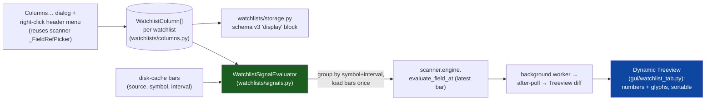

# Watchlist Signal Columns

Let the watchlist table show **user-chosen signal columns** per ticker —
RVOL, ADX, gap %, distance-from-EMA, HA-streak, and any other scanner
field — instead of the fixed `Ticker / Last / Change / Change% / Next`.
The point is a **signal-first, glanceable decision table**: "which of my
names are set up right now," without opening each chart. (Raw price/OHLC
columns stay low-value — the chart already shows price.)

> **Status: design spec — v1 not yet implemented.** This doc + the three
> colocated specs
> ([`watchlists/columns.spec.md`](../src/tradinglab/watchlists/columns.spec.md),
> [`watchlists/signals.spec.md`](../src/tradinglab/watchlists/signals.spec.md),
> [`gui/watchlist_columns_dialog.spec.md`](../src/tradinglab/gui/watchlist_columns_dialog.spec.md))
> capture the finalized design ahead of the implementation. The three
> `.py` modules currently ship as **API skeletons** (documented shapes,
> `NotImplementedError` bodies) so the spec-completeness invariant stays
> green. The nine decisions below were settled with the owner.

---

## Core idea

A watchlist column is an **ordered scanner `FieldRef`** (plus display
options), evaluated at the **latest bar** per symbol via the existing
`scanner.engine.evaluate_field_at`. **No watchlist-specific math** — the
scanner's field registry (`scanner/fields.py::all_fields()`) is the
single source of truth, so watchlist columns, scans, entries, and exits
all agree.

---

## The nine design decisions (v1)

| # | Decision | Choice |
|---|---|---|
| 1 | Picker ambition | **Full scanner field picker** — any built-in + opt-in indicator |
| 2 | Per-column tuning | **Params + interval** per column (D / 1h / 15m / 5m) |
| 3 | Relative / RS | **Deferred to v2** — v1 is absolute, active-symbol only |
| 4 | Default columns (new lists) | **Keep today's**: Ticker · Last · Change · Change% · Next |
| 5 | Cell styling | **Numbers + directional glyphs** (▲▼●) + existing row tint; no per-cell heat |
| 6 | Composite "setup" column | **Never** — individual signal columns only |
| 7 | Refresh | **Daily cadence + throttled intraday polling** for the visible watchlist |
| 8 | Config scope | **Global default + per-watchlist overrides** |
| 9 | Legacy columns | **Removable system columns** (ticker locked/first); per-watchlist persistence + back-compat |

---

## Architecture



**Three new modules** + edits to three existing ones:

1. **`watchlists/columns.py`** — the column model. `WatchlistColumn`
   (a `"system"` or `"signal"` column), serialization, defaults,
   validation (`ticker` locked & first), compact header labels.
2. **`watchlists/signals.py`** — `WatchlistSignalEvaluator`: batch-evaluate
   the configured columns across a symbol set at the latest bar, grouping
   by `(symbol, interval)`, loading bars once, reusing the scanner
   evaluation context + indicator memoization; a value cache. Headless.
3. **`gui/watchlist_columns_dialog.py`** — the "Columns…" dialog (reuses
   the scanner `_FieldRefPicker`) + the right-click header menu helpers.

Edits (documented here, specced when implemented):
`gui/watchlist_tab.py` (dynamic Treeview columns, header menu, glyph
render, worker generalization), `watchlists/storage.py` (schema v3
`display` block + back-compat), `watchlists/manager.py` (column
accessors), menu/toolbar wiring for "Columns…".

---

## Column model

```text
WatchlistColumn:
  kind:   "system" | "signal"
  id:     system id ("ticker","last","change","change_pct","next_earn")
          OR a stable signal id derived from the FieldRef
  ref:    FieldRef | None            # for kind="signal": field + params + interval
  label:  str                        # display override (else derived)
  width:  int
  anchor: "w" | "center" | "e"
  fmt:    "auto"|"number:N"|"percent"|"signed_pct"|"multiplier"|"int"|"date"|"glyph"
```

- **`ticker` is always the first column and cannot be removed** (validation
  enforces this).
- **Legacy price columns** (`last`, `change`, `change_pct`, `next_earn`)
  are `"system"` columns — removable so the owner can reclaim space.
- **Signal columns** carry a `FieldRef` (params + interval, active symbol
  in v1). The **raw value** (for sorting) is kept separate from the
  **formatted display** (for the cell).
- Compact **header label** encodes params + interval: `RVOL(20,5m)`,
  `ADX(14,D)`, `Gap%`; a tooltip carries the full description + interval.

---

## Compute model

- **Reuse only.** Each signal column resolves through
  `scanner.engine.evaluate_field_at(ref, ctx, latest_index)`; params /
  interval come from the `FieldRef`. `None` (insufficient data) →
  the cell renders `–`.
- **Interval is the column's own** (`FieldRef.interval`), default `1d`;
  the watchlist **never silently follows the chart interval**.
- **`WatchlistSignalEvaluator`** groups the work by `(source, symbol,
  interval)`, loads each symbol/interval's bars **once** (disk cache),
  builds one scanner context per symbol/interval, evaluates every ref
  needing it, and returns `{symbol: {column_id: ColumnValue}}` where
  `ColumnValue = {raw, text, state}` (`state ∈ ok|loading|insufficient|error`).
- **Background + Tk-safe.** Computation runs on the existing watchlist
  worker pool (generalizing `_preload_watchlist_daily`); results marshal
  to the Tk thread via the result-flag + `after`-poll pattern, then feed
  the existing incremental Treeview diff.
- **Caching + throttle.** A value cache keyed by `(source, symbol,
  interval, latest_ts, field_id, params)` avoids recompute until the bar
  or config changes; config-driven refreshes debounce (~250–500 ms); a
  generation token drops stale worker results.
- **Cadence** (decision 7): daily columns refresh on the daily cadence;
  intraday columns recompute on a throttled, bar-close-aligned poll while
  that watchlist tab is visible (reuses the existing RTH poll). Hidden /
  non-pinned watchlists don't compute.

---

## Persistence & back-compat (schema v3)

`watchlists/storage.py` gains an optional `display` block:

```json
{
  "version": 3,
  "watchlists": [...],
  "pinned": [...],
  "display": {
    "default_columns": [ {"kind":"system","id":"ticker"}, ... ],
    "by_watchlist": { "Longs": [ ...WatchlistColumn dicts... ] }
  }
}
```

- **v1 / v2 files load unchanged** — no `display` block → every watchlist
  uses **today's fixed 5 columns** (the default). The file is only
  rewritten (to v3) once the user actually edits columns (no silent
  churn on open).
- **Global default + per-watchlist overrides** (decision 8): a watchlist
  with no `by_watchlist` entry inherits `default_columns`; the dialog
  offers "copy from…", "set as default", and "reset to default".
- Unknown / invalid columns (e.g. a deleted custom indicator) are
  **dropped with a non-fatal warning**, never a crash.

---

## UI

- **Primary: a "Columns…" dialog** (toolbar button + right-click header
  "Configure columns…"): a searchable list of available fields (grouped
  Built-in / Indicators, reusing the scanner `_FieldRefPicker` for field
  + params + interval), an "Active columns" list with ↑/↓ reorder,
  rename, width/format, and a live preview. Titled by the active
  watchlist.
- **Secondary: right-click column-header menu** — Sort ▲/▼ · Add column…
  · Edit this column… · Remove · Move left/right · Columns…. `ticker`
  hides Remove.
- **Drag-to-reorder headers is deferred** (Tk header drag is fiddly);
  reorder via the dialog / header-menu in v1.
- **Cells** (decision 5): right-aligned numbers for magnitude
  (`2.1×`, `28`, `+1.2%`) + directional glyphs (`▲`/`▼` on signed values,
  `●`/streak for state); today's row bull/bear tint stays. **No per-cell
  heat** (`ttk.Treeview` can't style cells cleanly).
- **States**: loading `…`, insufficient-data `–`, error `!` (tooltip),
  optional stale marker; headers carry tooltips (full name + interval +
  params). Soft warning past ~10 columns; horizontal scroll exists but is
  discouraged.

---

## Phasing

**v1 (this design):** full field picker · per-column params + interval ·
absolute active-symbol columns · keep-today's defaults · numbers +
glyphs · daily + intraday-poll refresh · global default + per-watchlist
overrides · removable system columns · sorting.

**v2+ (deferred, seams left in place):**

- **Relative / RS columns** — cross-symbol pins (`@SPY`, sector) +
  relative indicators (expose RRVOL) + the **custom-RS formula as a
  scannable indicator** so it becomes a pickable column automatically.
- Conditional per-column coloring / heat (would need a custom table
  widget beyond `ttk.Treeview`).
- Drag-to-reorder headers.
- "Add column from a saved scan's ranking field."
- Column templates / import-export.

Explicitly **out of scope (owner decision):** a composite "setup"
(LONG/SHORT/WATCH) score column — the watchlist stays individual signal
columns.

---

## Testing plan

- **`watchlists/columns.py`** (`tests/unit/watchlists/test_columns.py`):
  serialize / round-trip; `from_dict` tolerates junk; `validate` keeps
  `ticker` first + locked, dedupes, drops invalid; compact header labels;
  default set == today's 5.
- **`watchlists/signals.py`** (`tests/unit/watchlists/test_signals.py`):
  latest-bar evaluation calls the engine with the last index; per-column
  interval respected; insufficient data → `None`/`–`; formatting
  (number/percent/multiplier/glyph); value-cache invalidation on
  latest-ts / config change. Headless.
- **`gui/watchlist_columns_dialog.py`** (`tests/unit/gui/test_watchlist_columns_dialog.py`):
  Agg/Tk — lists scanner fields, preserves params/interval, add/remove/
  reorder, `ticker` not removable, apply returns the ordered columns.
- **Storage** (`tests/unit/watchlists/test_storage.py` additions): v1/v2
  → v3 back-compat (no display → today's columns); lazy-write on change;
  per-watchlist override round-trip.
- **Smoke** (`tests/smoke`): a reachability check — open Columns…, add an
  RVOL column, verify the heading + a value or `–` render and the column
  sorts, no crash.

---

## See also

- [`WATCHLISTS.md`](WATCHLISTS.md) — the watchlist / universe system.
- [`watchlists/columns.spec.md`](../src/tradinglab/watchlists/columns.spec.md),
  [`watchlists/signals.spec.md`](../src/tradinglab/watchlists/signals.spec.md),
  [`gui/watchlist_columns_dialog.spec.md`](../src/tradinglab/gui/watchlist_columns_dialog.spec.md).
- `scanner/fields.spec.md` — the field registry this reuses.
